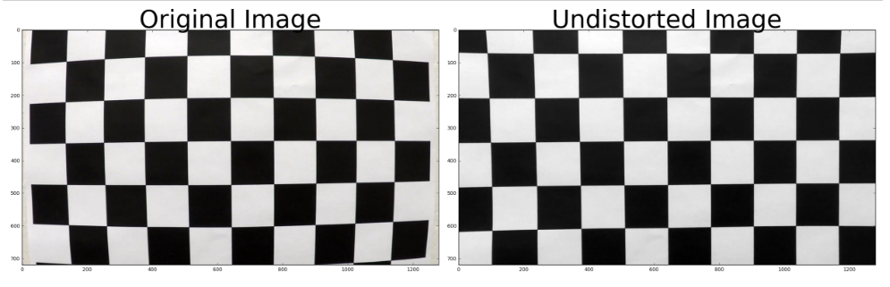
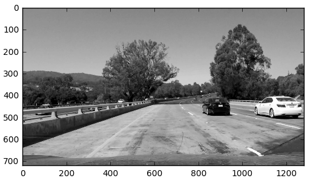
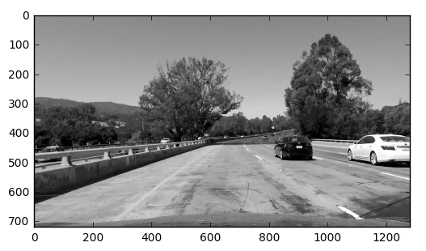
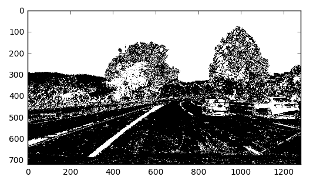
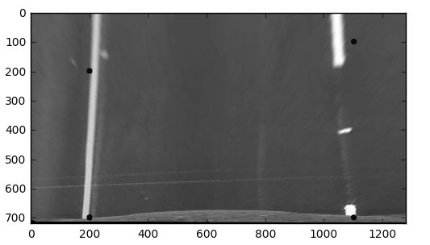
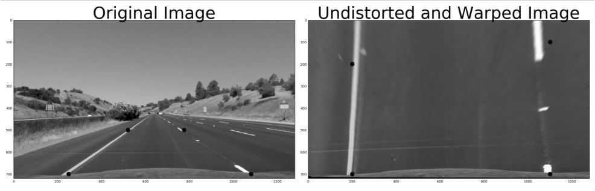
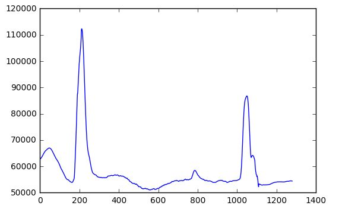
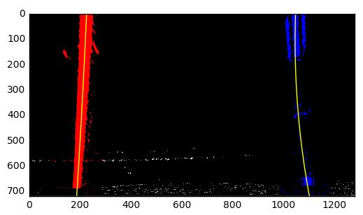
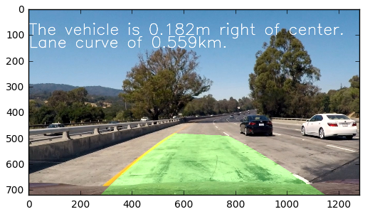

## Camera Calibration

The camera calibration code can be found in the project notebook advancedLaneFinding_p4.ipynb. The funtion, calibCamera(), for calibrating the code is in the helper function section. This function identifies all of the images in the camera_cal folder, it loops through each of those files, it applies the find chessboard camera function from cv2 to detect the corners in image space. A 3d grid is created using np.mgrid that is used to map the image corners to an object space. The object points object is the same for each image. Image points that are generated for each image have a corresponding replicate of the object points grid.

Image and object points are used as input into the cv2.calibrate camera object which will generate the coefficients that are used to undistort an image (cv2.undistort). The images are undistorted via the undistort_image() function in the project notebook. The following image shows an undistorted chessboard:

## Pipeline

An example of the full image processing pipeline can be found in the ipython notebook within the Image Processing Pipeline section. The pipeline is contained within the process_image() function.

#### 1. Undistorted Image

A sample undistored image can be found below. The image undistort code can be found in the undistor_img() function in the ipython notebook. This function takes in a grayscale image as a parameter as well as object and image points. It uses coefficients from the camera calibration cv2 function and passes outputs along with the source image to the cv2.undistort function. 

###### Grayscale converted test image before it is undistorted

###### Undistorted image

#### 2. Image Filter

The apply_filter() function returns a binary filtered image that uses seperate filters for color and gradient thresholds. This function combines gradient direction and magnitude thresholds as well as s_channel thresholds. The image below is a sample undistorted and filtered image.

###### Sample Filtered Image

#### 3. Perspective transform

The corners_unwarp() function contains the code that I used to perform a perspective transformation. The function takes an image as a single input and uses hard coded source points from an undistorted image and maps them to 4 defined points to produce an overhead view of the road. The following source and destination points were used.

    src = np.float32([(250,700), (520,500),(775,500),(1080,700)])

    dst = np.float32([[200,700], [200, 200],[1100,100], [1100,700]])
    
I identified the source points by plotting 4 points in an image and adjusting the coordinates until the points were aligned with the lane lines.

###### The following image is an example of an unwarped image.

###### Below is a side by side compare of an input and unwarped image:

#### 4. Lane Identification

Lanes are identified using the first_frame_window() and findLines_nextFrame() functions. The first function is used to perform a deep search on a frame using the sliding window technique. This function takes an unwarped image as input and returns positions for the left and right lanes, a fit line, and nonzero pixel locations for each line.The fit_lanes() function takes the output of this or the findLines_nextFrame() function as an input and fits a polynomial to the identified lane points. 

The function process_frame() applies logic to determine when to perform a deep and shallow search for the lines. This function looks at several features of the identified lanes including the x coordinates, distance between the lanes, and measurements to assess how parrallel the lines are. If these tests do not pass, a deep search is applied. If everything appears normal, then a shallow search is performed. To minimize variations in the lane mappings and wobbly lanes, a 5 frame moving average is applied before fitting the lane. 

Below is a sample of the identified lane pixels from a deep lane search as well as a fitted line.

###### Lane Histogram:

###### Fit Lanes Sample

#### 5. Lane Curvature and Vehicle  Position

The lane curvature is calculated in the getCurve() function found in the note book. This function takes points found in both the left and right lanes. The functions fits a point and then finds the curvature of polynomial using the equation outlined in the class. The curvature is converted to real world measurements and added to the image. This measurement is based on a pixels per lane width ratio.

The vehicle position is calculated within the find_veh_pos() function. This code takes the left and right base of the lane lines as input. It assumes that the center of the image == the center of the vehicle. The lane distance is calculated from the base and the vehicle position is calculated as the difference between lane and line center. This measurement is also converted to real world measurements using the same pixel conversion.

#### 6. Mapped Lane
The lines are painted on the image through the paint_laneLines() function in the ipython notebook. This is the same approach outlined in the lectures. This function creates a blank color space image using the transformed image to hold the poly fil. It uses the left and right fit lines to generate a lines for poly fill on the transformed image. The function then transforms the image back to the original view using the transformation matrix that is generated during the inital image warp.

###### Sample Processed Image with Lane Lines

###### All Processed Test Images

## Video Processing

The video processing pipeline can be viewed in the "Process the Videos" section of the ipython notebook. This function uses the processMovie() and processFrame() function to conduct the processing. processMovie() is used to manage the lines and smoothing to remove distortions in the final lane painting. This function takes a frame as input and determines how to process it based on the lines that have already been processed. This function also manages the creation of new line objects. It passes the frame to the processFrame function with arguments that determine if the frame should be processed through a shallow or deep search.

The final project video can be found here:

https://youtu.be/Cs9dRpGKIn0

The challenge video can be found here:

https://youtu.be/86OyO5qg62E

## Project Approach

I broke the lane finding problem into the pipeline step very early in the process and worked to iron out any issues before moving to the next phase of the pipeline. I used the test images to test each phase of pipeline and try to address any edge cases or problem areas that presented themselves.

Determine the thresholds for gradients and the color space consumed most of my time during testing. I exerimented with several combinations of the filters to create a binary image before finding somthing that seemed to work in most cases for the test images.

I utilized the suggested approach from the lectures for finding the lane lines, calculating curvature, and painting the lines back to the original image. 

To stabilize the lines, I used a 5 frame moving average to smooth out the lane detection and fit. There are some slight wobbles, but the video is smooth for the most part.

The challenge video is able to find the lines, but the polyfill jumps around. The issue seems to be in the inconsistency in the painted lines and the frames where the lanes appear to narrow or transition to a more narrow lane. Having driven through a construction zone recently, I can see where this may be a problem. Temporary lane lines are printed on the lines and often overlap or intersect the permanent lane lines. Other lane distortions like multicolored pavement that produce a line in the center of the road also appear to be a problem. Some color filtering can help this.

Roads where lines are completely absent (e.g. rural roads and city streets) will exhibit the same issue. Mapping the road could be a possibility, but mapping individual lanes could be a challenge. One approach would be to detect the left and right edges of the road and then generate the left hand lane line through standard lane widths.

